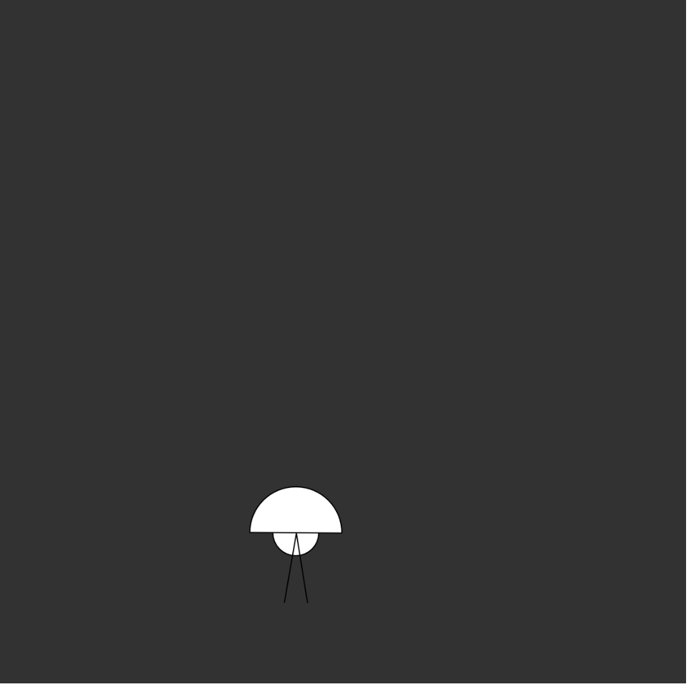

# jellyfish-game
####
```
by oran collins
github.com/wisehackermonkey
oranbusiness@gmail.com
20200613
```
# TODO
- ~~interaction
- tweening library
- tenticals rendering
- ik tenticals, or sine wave version

[](https://postimg.cc/hJxxNGLp)
<!-- ### install -->
<!-- ### Build -->
# Live Demo
# [Click Here](https://wisehackermonkey.github.io/jellyfish-game/)
### Run
```
python -m http.server 
```

# Gif dev log
#### v1

<!-- # Links -->
<!-- # Links -->


